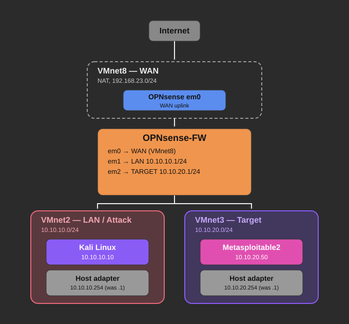

# Cybersecurity Homelab — Segmented Pentest Range on VMware Workstation

A self-built, network-segmented cybersecurity lab used to practice offensive techniques (Metasploit exploitation) and to develop hands-on firewall/routing troubleshooting skills — built as part of a personal path toward SOC / DFIR work.



## Overview

This lab runs entirely on a single host under VMware Workstation Pro, with three isolated network segments connected through a central OPNsense firewall/router:

| Segment | VMnet | Type | Subnet | Purpose |
|---|---|---|---|---|
| WAN | VMnet8 | NAT | 192.168.23.0/24 | Internet uplink for the firewall only |
| LAN / Attack | VMnet2 | Host-only | 10.10.10.0/24 | Attacker workstation (Kali Linux) |
| Target | VMnet3 | Host-only | 10.10.20.0/24 | Deliberately vulnerable targets |

The attack and target segments have **no direct path to the home network or the internet** — all inter-segment traffic is routed and filtered through OPNsense, giving a safe, fully isolated range for exploitation practice.

## Why this project

Most "spin up Kali and pwn Metasploitable" tutorials skip the part that actually teaches you something: getting the network right. Building the segmentation, routing, and firewall rules from scratch — and then debugging why traffic silently disappeared between segments — turned out to be the most valuable part of the exercise. See [`docs/troubleshooting.md`](docs/troubleshooting.md) for that process.

## Repo structure

```
.
├── README.md
├── diagrams/
│   └── network-topology.svg
└── docs/
    ├── architecture.md        # full technical breakdown: interfaces, IPs, VM specs
    ├── troubleshooting.md     # key issues hit while building this and how they were solved
    └── exploitation-log.md    # nmap results + exploits run against the target
```

## Stack

- **Hypervisor:** VMware Workstation Pro
- **Firewall / Router:** OPNsense 26.7
- **Attacker:** Kali Linux (Metasploit Framework, nmap)
- **Target:** Metasploitable2

## Highlights

- Designed and implemented a 3-segment network (WAN / Attack / Target) with a virtual firewall handling all inter-segment routing and filtering
- Diagnosed and resolved two separate IP-address conflicts between VMware's host-side virtual adapters and the firewall's gateway addresses, using `tcpdump`, `arp`, and `pfctl` state inspection to trace packets hop-by-hop
- Identified that FreeBSD's `emX` interface naming did not match the order interfaces were added in VMware, and built a verification method to confirm real interface-to-vSwitch mapping before trusting any assumption
- Exploited multiple intentionally vulnerable services (vsftpd backdoor, UnrealIRCd backdoor) via Metasploit Framework, obtaining root-level Meterpreter sessions

## Next steps

- Deploy Security Onion (Suricata / Zeek / Elastic stack) on a SPAN/mirror port to observe the same attacks from a defender's perspective
- Add DVWA / OWASP Juice Shop for web application testing
- Try additional identified attack vectors on Metasploitable2 (Samba RCE, database weak-credential access)

## Disclaimer

This lab is fully isolated from any production or third-party network. All targets are intentionally vulnerable software designed for security training (Metasploitable2). Nothing here should be run against systems you don't own or have explicit permission to test.
